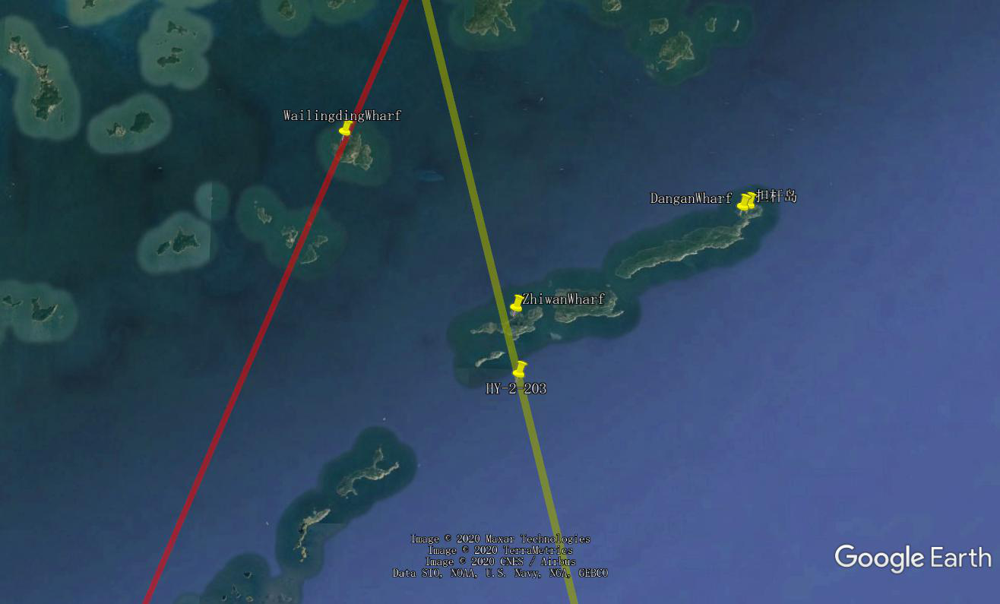

## Introduction

The tide gauge data were provided freely by National Satellite Ocean Application Service.

The Zhuhai Wanshan site locates over the southern ocean of HongKong.  The main aim of this site is to calibrate the HY-2 series satellite altimeters. Three tide gauges were built and began data collection since 2019. Accompanied with GNSS stations, the benchmarks of the three tide gauges were measured to the WGS-84 ellipsoid.

The Jason-2 passes over wanlingding site. The HY-2 passes over the zhiwan site.

The sites map :

The coodinates of three tide gauges:
-wanlingding 22.108N 114.0294E
-zhiwan 21.9949N 114.1479E
-dangan 22.0594N 114.3036E